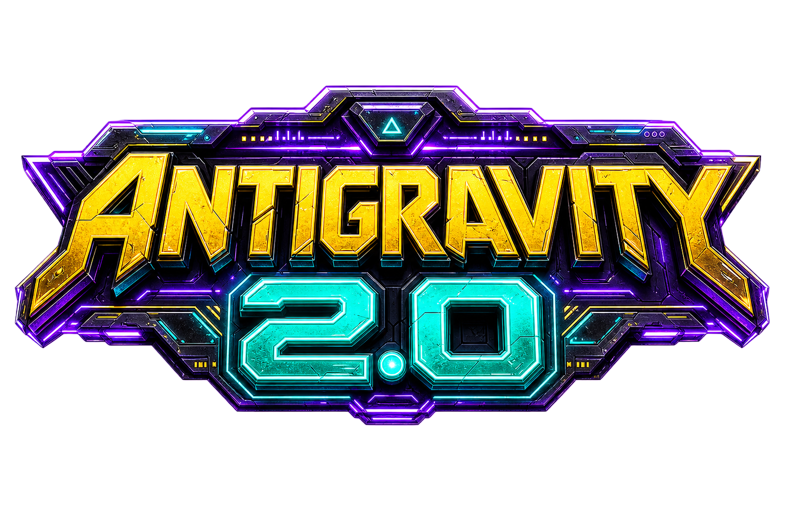
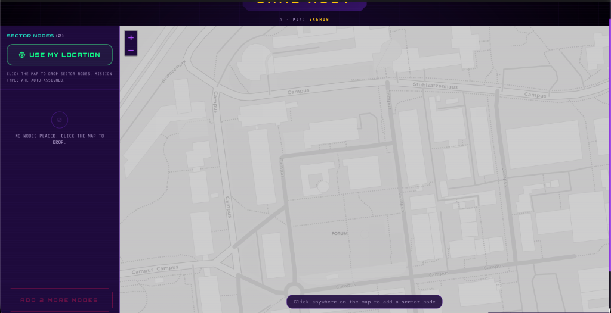
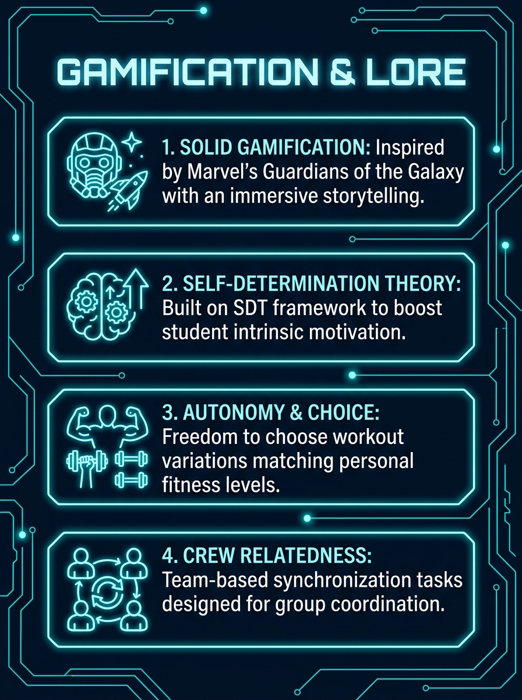
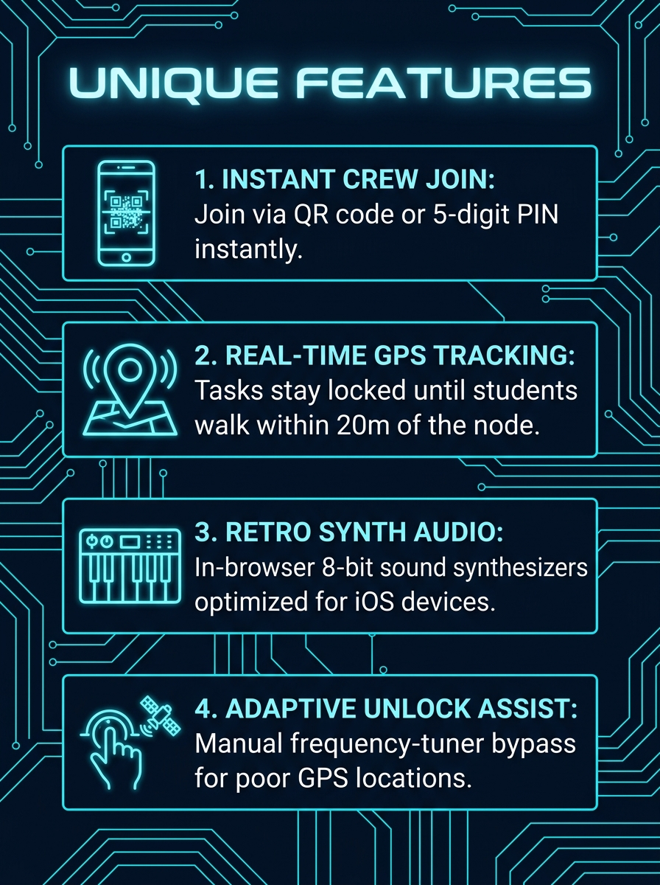

  

# Antigravity 2.0 - Immersive Gamified Scavenger Hunt

**Antigravity 2.0** is an innovative, cyberpunk-themed outdoor scavenger hunt application designed for school PE classes. Grounded in Deci & Ryan's **Self-Determination Theory (SDT)** and heavily inspired by **Marvel's Guardians of the Galaxy**, the application transforms regular physical education challenges into an immersive narrative space mission.

---

## Screenshots & Visuals

### 1. Teacher Dashboard & Real-Time Map Setup
The teacher ("Commander") drops sector nodes on the map and monitors live team progress:

### 2. Gamification & Storytelling
Designed to boost student intrinsic motivation using the Self-Determination Theory (SDT) framework:

### 3. Unique Technical Features
High-tech modules built directly into the student browser viewport:

---

## 🧠 Key Pedagogical Pillars (SDT Integration)
* **Autonomy (Choice)**: Students have the freedom to choose exercise variations that match their physical limits (e.g. selecting between *Cardio Jumping Jacks* or *Active Running*).
* **Competence (Mastery)**: Real-time physiological coaching cues, adaptive difficulty adjustments, and clear targets guide student progression.
* **Relatedness (Team Dynamics)**: Group coordination challenges (e.g. *Synchronized Jacks*, *Mirror Squats*) require active collaboration to succeed.

---

## ⚡ Key Technical Pillars
* **Real-time GPS Tracking**: Coordinates are tracked live; checkpoint tasks remain securely locked until the student crew physically enters a 20-meter range of the target node.
* **Retro Synth Audio Engine**: Powered by the Web Audio API, the app synthesizes retro 8-bit sound effects and ticking timers dynamically in the browser (cross-platform and optimized to bypass iOS Safari autoplay blocks).
* **Adaptive Unlock Assist**: A failsafe frequency-tuner slider lets students bypass and unlock targets manually if GPS signal is weak or blocked (e.g., indoor gyms).

---

## 🚀 Setup & Run
To run the system locally or deploy it to production, follow the step-by-step setup guides inside:
👉 **[DEPLOYMENT.md](DEPLOYMENT.md)**
